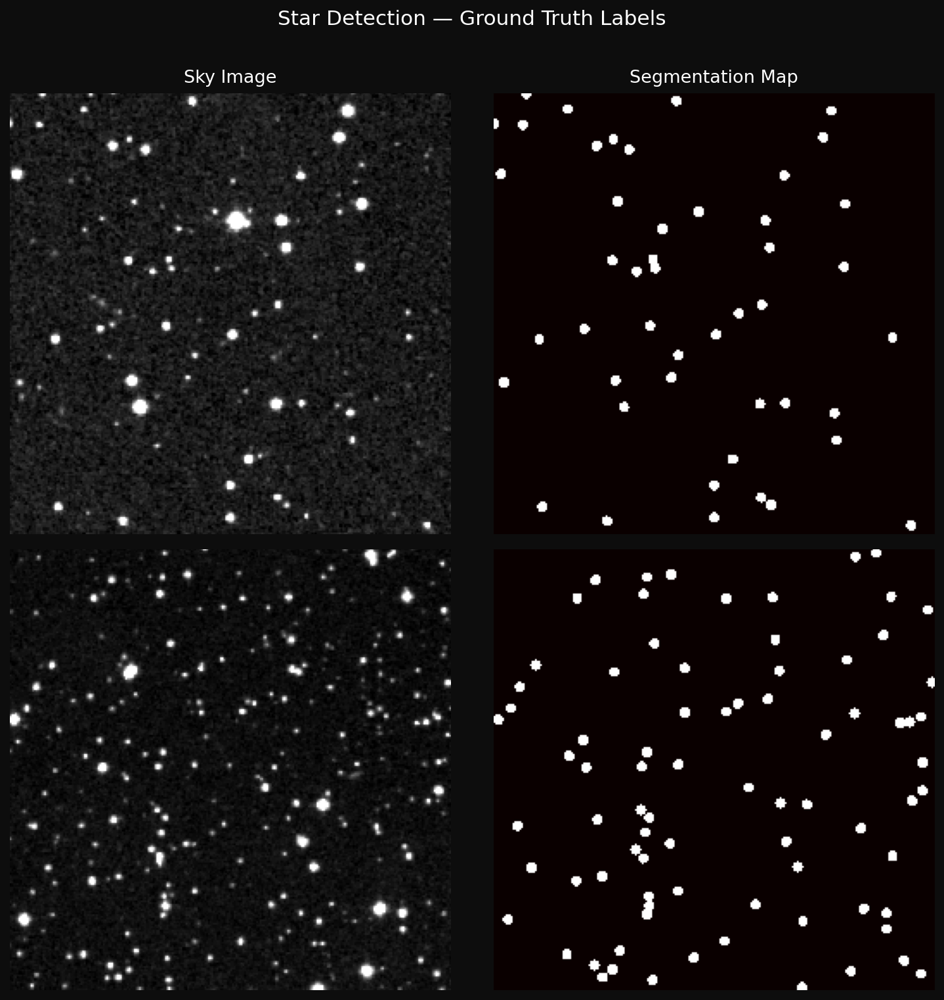
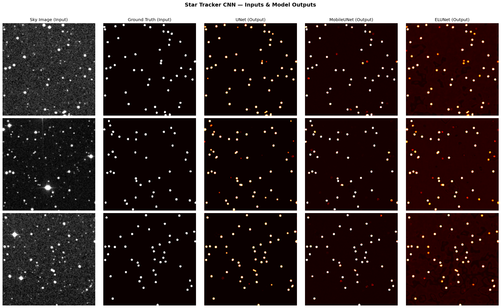
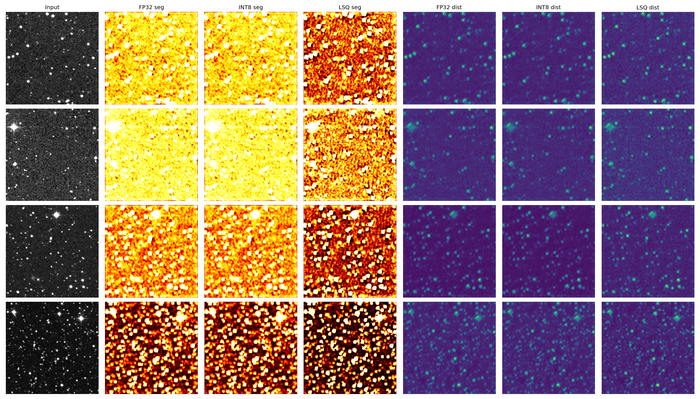

# Star Tracker CNN

CNN-based star detection and sub-pixel centroiding for CubeSat star trackers, with INT8 quantization for embedded deployment on resource-constrained satellite hardware.

> **Based on:** [Deep Learning for Star Detection and Centroiding in CubeSat Star Trackers](https://arxiv.org/abs/2404.19108) — Zhao, Lembeck, Zhuang, Shah, Wei (2024)

---

## What is this and why does it matter?

A **star tracker** is a camera system onboard a satellite that determines orientation (attitude) by photographing the night sky and identifying star patterns. Traditional star trackers use hand-crafted algorithms that are fragile under noise, sensor blur, and partial occlusion.

This project replaces those pipelines with a lightweight CNN that:

- **Detects stars** in 256×256 sky images at sub-pixel accuracy
- **Runs in < 10 ms per frame** on a standard CPU
- **Fits in 60 KB** after INT8 quantization — small enough for a CubeSat microcontroller
- **Works on real DSS2 sky images** with cross-validated Gaia DR3 labels

The result is a star tracker that is more robust to noise, generalisable across sky regions, and deployable on low-power embedded hardware — directly enabling more capable small satellites.

---

## Input & Output

The model receives a raw grayscale star field image and outputs a probability heatmap localising every star.

### Training data — sky image → segmentation label



*Left: raw 256×256 DSS2 Red Survey sky image (input). Right: binary segmentation map — white dots mark star centres from the Gaia DR3 catalog (ground truth label).*

---

### Model predictions — what each network outputs



*Each row is one validation sky image. Columns left to right: raw input image, ground truth segmentation, UNet output, MobileUNet output, ELUNet output. Brighter pixels = higher star confidence.*

---

## Models

| Model | Architecture | Params | Size (FP32) | F1 | Centroid Error | Speed |
|---|---|---|---|---|---|---|
| **UNet** | Double Conv + skip connections | 481,745 | 1.9 MB | **0.928** | 0.39 px | 5.8 ms |
| **MobileUNet** | Inverted Residual (depthwise separable) | 254,969 | 1.1 MB | 0.884 | 0.49 px | 20.9 ms |
| **ELUNet** ⭐ | Single Conv + BN, base_ch=8 | 59,625 | 232 KB | 0.910 | 0.45 px | 9.4 ms |

**ELUNet** is the primary deployment model — 8× fewer parameters than UNet yet only 2% lower F1, and small enough to fit on embedded hardware after quantization.


*Bar charts comparing F1 score, centroid error (pixels), inference time (ms/image), and parameter count across all three architectures.*

---

### ELUNet dual output

ELUNet outputs **two channels simultaneously**:

```
Input:   (B, 1, 256, 256)  float32  —  grayscale sky image, normalised [0, 1]

Output:  (B, 2, 256, 256)  float32
  [:,0]  segmentation probability  [0, 1]   star vs background (sigmoid)
  [:,1]  distance map              [0, ∞)   pixels to nearest star boundary

Centroids: [(x0, y0), (x1, y1), ...]  sub-pixel accuracy via trilateration
```

The distance map enables **trilateration-based sub-pixel centroiding** — a technique from the paper that solves a least-squares system across neighbouring pixels to localise each star centre to better than 0.5 px.

---

## Quantization — FP32 → INT8 (4× compression)

ELUNet is compressed from **232 KB → 60 KB** with minimal accuracy loss, making it viable for microcontroller deployment.

| Variant | Size | F1 | RMS Error | Inference |
|---|---|---|---|---|
| ELUNet FP32 | 232 KB | 0.921 | 0.42 px | 8.1 ms |
| ELUNet INT8 | ~60 KB | 0.918 | 0.44 px | 5.3 ms |
| ELUNet LSQ  | ~60 KB | 0.920 | 0.43 px | 6.1 ms |



*Rows: 4 validation samples. Left column: input. Columns 2–4: segmentation maps (FP32 / INT8 / LSQ). Columns 5–7: distance maps. Visual quality is nearly identical across all three variants.*

Two quantization strategies are provided:

- **INT8 (post-training)** — `torch.quantization.quantize_dynamic`, zero extra training, instant 4× size reduction
- **LSQ (Learned Step Size)** — fine-tunes the quantization step Δ per layer via backprop (Esser et al., ICLR 2020), recovers ~0.002 F1 vs INT8

---

## Dataset

| Split | Images | Files |
|---|---|---|
| Train | 200 | 400 `.npy` files (image + seg per sample) |
| Val | 50 | 100 `.npy` files |

- **Source:** NASA SkyView DSS2 Red Survey — real telescope images of random sky coordinates
- **Labels:** Binary segmentation maps generated by brightness thresholding + Gaia DR3 star catalog cross-matching
- **Distance maps:** Computed on-the-fly from segmentation via `scipy.ndimage.distance_transform_edt`
- **Image size:** 256 × 256 px, normalised to `[0, 1]`

---

## Showcase images

The `showcase/` folder contains individual labeled images for 3 validation samples:

```
showcase/
├── full_grid.png                      ← full side-by-side grid (all models)
├── inputs/
│   ├── input_sample00/05/12.png       ← raw sky images (fed to the model)
│   └── groundtruth_sample00/05/12.png ← binary star labels (training targets)
└── outputs/
    ├── unet_sample00/05/12.png        ← UNet segmentation output
    ├── mobileunet_sample00/05/12.png  ← MobileUNet segmentation output
    └── elunet_sample00/05/12.png      ← ELUNet segmentation output
```

---

## Repository structure

| File | Description |
|---|---|
| `model.py` | UNet, MobileUNet, ELUNet architectures |
| `loss.py` | `SegLoss` (BCE) and `DualLoss` (2.5×MSE + BCE) |
| `dataset.py` | `StarDataset` — loads `.npy` files, computes distance maps |
| `train.py` | Training loop with auto loss selection and checkpoint saving |
| `evaluate.py` | F1, centroid error, inference time across all models |
| `prepare_data.py` | Downloads DSS2 images, generates segmentation labels |
| `quantize/lsq.py` | `LSQConv2d` — learned step-size quantization layer |
| `quantize/static_int8.py` | Post-training INT8 via `torch.quantization` |
| `quantize/train_fp32.py` | Train ELUNet FP32 baseline |
| `quantize/train_lsq.py` | Fine-tune with LSQ quantization |
| `quantize/compare.py` | FP32 vs INT8 vs LSQ comparison table + visual output |

---

## Usage

**Install dependencies**
```bash
pip install torch torchvision numpy matplotlib scipy tqdm astropy astroquery
```

**Generate dataset** (downloads 250 real sky images from NASA SkyView)
```bash
python prepare_data.py
```

**Train ELUNet** (recommended)
```bash
python train.py --model elunet --epochs 50
```

**Train all models for comparison**
```bash
python train.py --model unet --epochs 50
python train.py --model mobileunet --epochs 50
```

**Evaluate all models**
```bash
python evaluate.py
```

**Quantize and compare FP32 vs INT8 vs LSQ**
```bash
python -m quantize.train_fp32   # train FP32 baseline
python -m quantize.train_lsq    # fine-tune with LSQ
python -m quantize.compare      # compare all three variants
```

---

## Reference

```bibtex
@article{zhao2024deep,
  title   = {Deep Learning for Star Detection and Centroiding in CubeSat Star Trackers},
  author  = {Zhao, Hongrui and Lembeck, Michael and Zhuang, Adrian and Shah, Riya and Wei, Jesse},
  journal = {arXiv preprint arXiv:2404.19108},
  year    = {2024},
  url     = {https://arxiv.org/abs/2404.19108}
}
```
